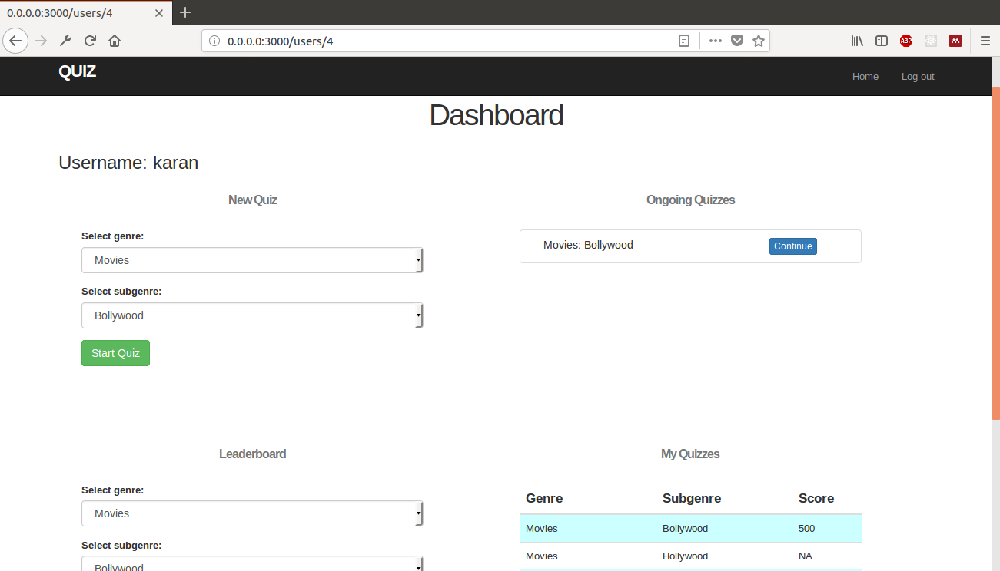
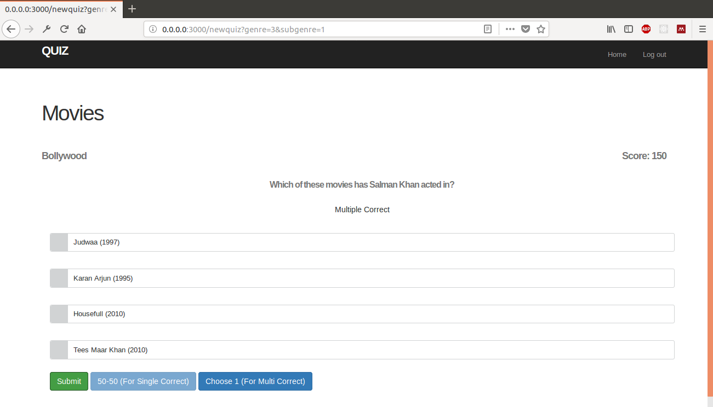

# Quizapp

This is a web based State Restoring Quiz Game developed using Ruby on Rails.

## Versions:
- Ruby - 2.5.1p57
- Rails - 5.1.4

## Build and Execution
For installation of Ruby and Rails, refer https://gorails.com/setup/ubuntu/16.04

After the installation is complete, enter the project root directory and type
```
bundle install
rails server
```
This will install all the Gems used in the project and start the server. The website can be accessed at `0.0.0.0:3000` from your browser.

## Features
- Registration and Login for users
- Admin Panel
- Multiple genres and sub-genres
- Includes Multiple Choice Single Correct and Multiple Choice Multiple Correct questions
- Leaderboards for each genre and sub-genre
- 2 linelines, one for each type of question. They can be used only one per quiz.
  - 50-50 deletes two incorrect options from a Single Correct question
  - Choose 1 marks one correct option in Multiple Correct questions

## Screenshots
  
<br><br>

